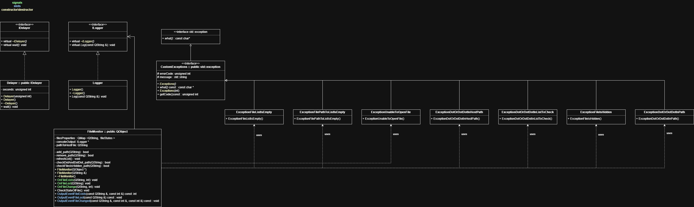
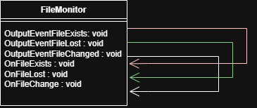

# Techn_progr


## Назначение

Программа отслеживает состояние набора файлов, пути к которым хранятся в отдельном текстовом файле. При проверке каждого наблюдаемого файла выводится одно из трех сообщений:

1. файл существует и его размер известен;
2. файл существует, но его размер изменился;
3. файл отсутствует.

Для обработки событий изменения состояния используется механизм сигналов и слотов Qt.

## UML



## Signals-slots



## Как это работает

- При запуске программа запрашивает путь к файлу-списку.
- Файл-список должен содержать абсолютные пути к наблюдаемым файлам, по одному пути в строке.
- Пустые строки в файле-списке игнорируются.
- После чтения списка программа периодически проверяет состояние файлов и выводит сообщения в консоль.

## Формат входных данных

Файл-список, например ```HostFile.txt```, содержит строки вида:

```text
E:/path/to/file1.txt
E:/path/to/file2.txt
...
```

## Вывод программы

- если файл существует и не изменился, выводится сообщение о его существовании и размере;
- если размер файла изменился, выводится сообщение о старом и новом размере;
- если файл исчез, выводится сообщение о том, что он не существует.

## Сборка и запуск

Проект собран на Qt с модулем `core` и требует поддержку C++17.

Запуска из Qt Creator:

1. открыть файл проекта .pro
2. выбрать конфигурацию сборки;
3. собрать проект;
4. запустить приложение и указать путь к файлу-списку.

## Структура проекта

- ```main.cpp``` — точка входа;
- ```FileMonitor.h``` и ```/src/FileMonitor.cpp``` — логика наблюдения за файлами;
- ```ConsoleLogger.h``` и ```/src/ConsoleLogger.cpp``` — вывод сообщений;
- ```Delayer.h``` и ```/src/Delayer.cpp``` — задержка между проверками.

## Особенности реализации

- проверка состояния файлов выполняется циклически с паузой между итерациями;
- изменения размера файла определяются сравнением предыдущего и текущего состояния;
- исключения используются для обработки ошибок чтения файла-списка и некорректных путей.
